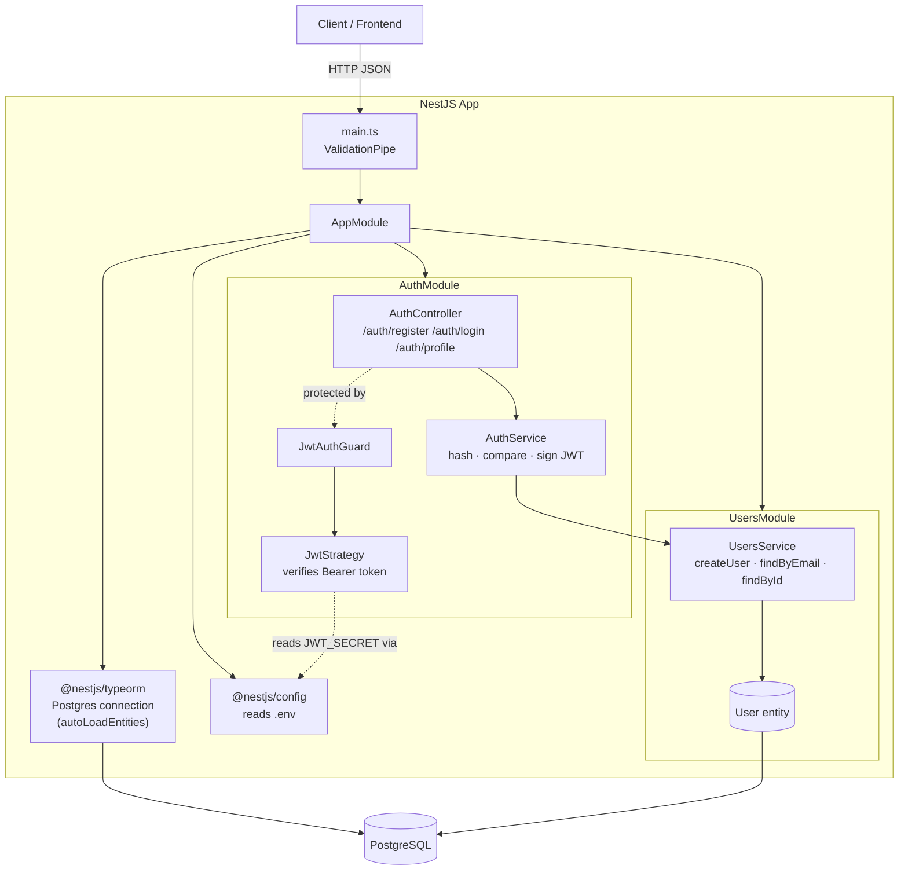
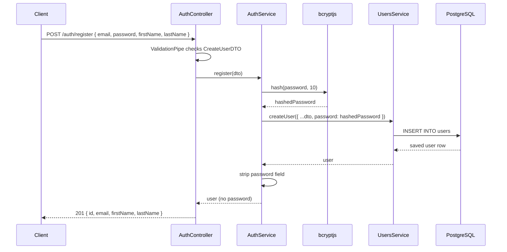
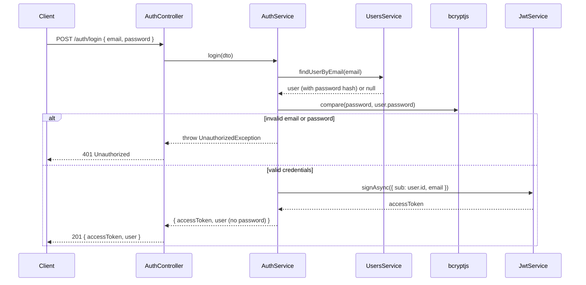
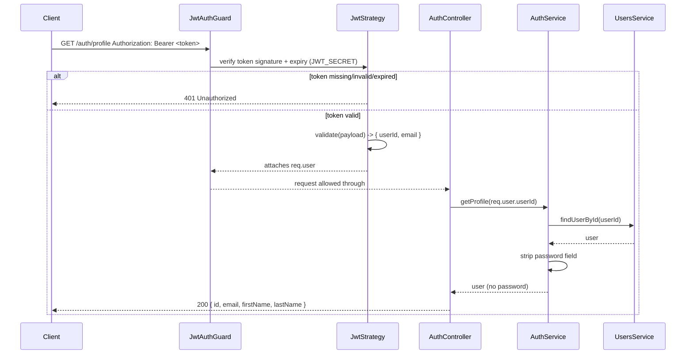

<p align="center">
  <a href="http://nestjs.com/" target="blank"></a>
</p>

<p align="center">Backend API for the Pomodoro app, built with NestJS, TypeORM and PostgreSQL.</p>

## 1. What this project is

This is the backend for a Pomodoro timer app. Right now it implements **user accounts and authentication**:

- Register a new account (`POST /auth/register`)
- Log in and receive a JWT (`POST /auth/login`)
- Fetch the logged-in user's profile using that JWT (`GET /auth/profile`)

Everything else (pomodoro sessions, tasks, stats, etc.) will be built on top of this same pattern: a `*.module.ts` wiring things together, a `*.controller.ts` handling HTTP, a `*.service.ts` holding business logic, and TypeORM entities describing the database tables.

## 2. Tech stack — what's used, where, and why

| Package | Used in | Why it's there |
|---|---|---|
| `@nestjs/core`, `@nestjs/common`, `@nestjs/platform-express` | Everywhere (`main.ts`, every module/controller/service) | The NestJS framework itself: dependency injection, decorators (`@Controller`, `@Injectable`, `@Module`...), and the underlying Express HTTP server. |
| `@nestjs/config` | [app.module.ts](src/app.module.ts) via `ConfigModule.forRoot({ isGlobal: true })` | Loads `.env` and exposes it through `ConfigService`, so `DB_*` and `JWT_SECRET` values aren't hardcoded. `isGlobal: true` means any module can inject `ConfigService` without re-importing `ConfigModule`. |
| `@nestjs/typeorm` + `typeorm` + `pg` | [app.module.ts](src/app.module.ts) (connection), [users.module.ts](src/users/users.module.ts) (`forFeature([User])`), [users.service.ts](src/users/users.service.ts) (`@InjectRepository`) | `typeorm` is the ORM that maps the `User` class to a Postgres table; `pg` is the actual PostgreSQL driver TypeORM talks to; `@nestjs/typeorm` glues TypeORM into Nest's DI system (`Repository<User>` becomes injectable). |
| `class-validator` + `class-transformer` | [create-user.dto.ts](src/auth/dto/create-user.dto.ts), [login.dto.ts](src/auth/dto/login.dto.ts), enabled globally via `app.useGlobalPipes(new ValidationPipe())` in [main.ts](src/main.ts) | `class-validator` decorators (`@IsEmail`, `@MinLength`, ...) declare the rules; the global `ValidationPipe` uses `class-transformer` to turn the raw JSON body into a real DTO class instance and then validates it, rejecting bad requests with a 400 before they ever reach a controller method. |
| `bcryptjs` | [auth.service.ts](src/auth/auth.service.ts) | Hashes passwords before saving them (`bcrypt.hash`) and verifies a login attempt (`bcrypt.compare`) without ever storing or comparing plaintext passwords. |
| `@nestjs/jwt` | [auth.module.ts](src/auth/auth.module.ts) (`JwtModule.registerAsync`), [auth.service.ts](src/auth/auth.service.ts) (`jwtService.signAsync`) | Signs the access token handed back on login, using `JWT_SECRET` from `.env` and a 1-day expiry. |
| `@nestjs/passport` + `passport` + `passport-jwt` | [jwt.strategy.ts](src/auth/strategies/jwt.strategy.ts), [jwt-auth.guard.ts](src/auth/guards/jwt-auth.guard.ts) | `passport-jwt` knows how to pull a `Bearer <token>` out of the `Authorization` header and verify its signature; `@nestjs/passport` wraps that as a Nest `Strategy`/`AuthGuard` so a route can be protected with a single `@UseGuards(JwtAuthGuard)`. |
| `reflect-metadata` | Implicitly required by Nest/TypeORM decorators | Lets decorators like `@Column()` or `@Injectable()` attach metadata to classes at runtime — required boilerplate for both frameworks, not called directly. |
| `rxjs` | Implicit Nest dependency | Nest's internal request pipeline (interceptors, some lifecycle hooks) is Observable-based under the hood. |

## 3. Folder structure

```
src/
├── main.ts                 # entry point: creates the Nest app, enables ValidationPipe, listens on PORT
├── app.module.ts           # root module: loads .env, opens the TypeORM/Postgres connection, wires AuthModule + UsersModule
├── app.controller.ts       # GET / — trivial health/welcome route
├── app.service.ts
├── auth/
│   ├── auth.module.ts       # registers JwtModule + PassportModule, imports UsersModule
│   ├── auth.controller.ts   # POST /auth/register, POST /auth/login, GET /auth/profile
│   ├── auth.service.ts      # register/login business logic, password hashing, JWT signing
│   ├── dto/
│   │   ├── create-user.dto.ts  # validated shape of a register request
│   │   └── login.dto.ts        # validated shape of a login request
│   ├── strategies/
│   │   └── jwt.strategy.ts     # how an incoming JWT is extracted + verified
│   └── guards/
│       └── jwt-auth.guard.ts    # @UseGuards(...) wrapper around the "jwt" strategy
└── users/
    ├── users.module.ts       # registers the User TypeORM repository (forFeature)
    ├── users.service.ts      # createUser / findUserByEmail / findUserById — direct DB access
    └── entities/
        └── user.entity.ts     # the `users` Postgres table definition
```

**Why auth and users are separate modules:** `UsersService` only knows about the `User` entity and the database — it has no idea what a password hash or a JWT is. `AuthService` owns all the security logic (hashing, comparing, signing tokens) and calls into `UsersService` just to read/write rows. This keeps persistence and security concerns from bleeding into each other, and lets other modules (e.g. a future `PomodoroModule`) reuse `UsersService` without dragging in JWT/passport code.

## 4. Environment variables (`.env`)

| Variable | Used by | Purpose |
|---|---|---|
| `DB_HOST`, `DB_PORT`, `DB_USERNAME`, `DB_PASSWORD`, `DB_DATABASE` | [app.module.ts](src/app.module.ts) → `TypeOrmModule.forRootAsync` | Postgres connection details. |
| `JWT_SECRET` | [auth.module.ts](src/auth/auth.module.ts) (signing) and [jwt.strategy.ts](src/auth/strategies/jwt.strategy.ts) (verifying) | The symmetric secret used to sign and verify JWTs. Must be the same value in both places — it is, because both read it from this one `.env` entry. |

`synchronize: true` and `autoLoadEntities: true` are set on the TypeORM connection, so any `@Entity()` class registered via `forFeature([...])` in some module is automatically picked up and its table auto-created/updated — no manual migrations needed at this stage of the project.

## 5. Architecture diagram



## 6. Request flows

### Register



### Login



### Profile (JWT-protected route)



## 7. API reference

| Method | Path | Auth required | Body | Success response |
|---|---|---|---|---|
| `POST` | `/auth/register` | No | `{ email, password, firstName, lastName }` | `201` — created user (no password) |
| `POST` | `/auth/login` | No | `{ email, password }` | `201` — `{ accessToken, user }` |
| `GET` | `/auth/profile` | Yes — `Authorization: Bearer <accessToken>` | — | `200` — current user (no password) |

## 8. Project setup

```bash
$ npm install
```

Create a `.env` file (see [section 4](#4-environment-variables-env)) before starting the app — it needs a reachable Postgres instance.

## 9. Compile and run the project

```bash
# development
$ npm run start

# watch mode
$ npm run start:dev

# production mode
$ npm run start:prod
```

## 10. Run tests

```bash
# unit tests
$ npm run test

# e2e tests
$ npm run test:e2e

# test coverage
$ npm run test:cov
```

## 11. Resources

- [NestJS Documentation](https://docs.nestjs.com)
- [TypeORM Documentation](https://typeorm.io)
- [Passport-JWT](https://github.com/mikenicholson/passport-jwt)
